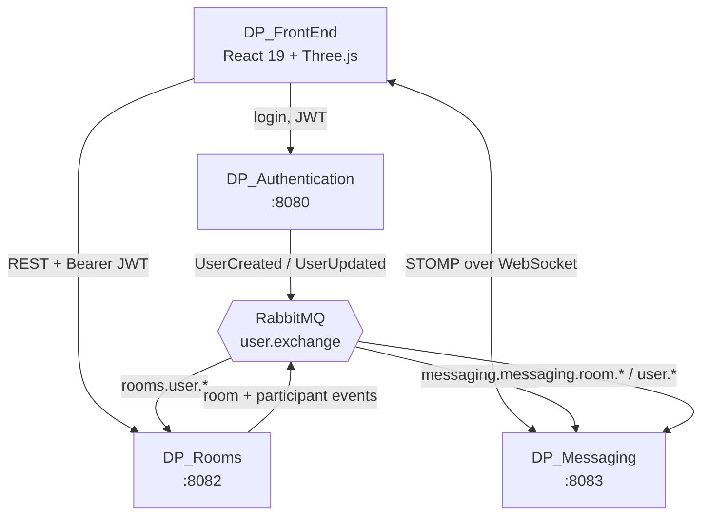

# DP_Messaging

**A real-time collaborative 3D piano — play together in the browser.**


🎹 **[Try it live →](https://duopiano.masemharuspex.com/)**


---

## The system

Duo Piano is four services. This repo carries every realtime message and keystroke.



Rooms and Messaging never call Auth on the request path. Each keeps a local
read-model projection of users (and, in Messaging, of rooms) built from
RabbitMQ events, and validates incoming JWTs against Auth's public keys. A
slow or restarting auth service cannot stall a piano session.

| Repo | Role | Port |
|---|---|---|
| [DP_Authentication](https://github.com/mkepg/DP_Authentication) | OAuth2 authorization server, user identity | 8080 |
| [DP_Rooms](https://github.com/masem-haruspex/DP_Rooms) | Room lifecycle, participants, moderation | 8082 |
| **DP_Messaging** ← you are here | Realtime messaging and live key events | 8083 |
| [DP_FrontEnd](https://github.com/masem-haruspex/DP_FrontEnd) | React 19 + React Three Fiber client | — |

## What this service does

This is what makes the piano collaborative. When two people share a room, every
key one player presses travels through this service to the other player's browser
and triggers the same note.

- STOMP over WebSocket (SockJS fallback) for realtime fan-out
- Broadcasts piano key events between players in a room
- Chat messages, persisted to PostgreSQL
- Presence tracking via STOMP subscribe and disconnect listeners
- Consumes nine RabbitMQ queues to mirror users and rooms locally
- Per-endpoint and per-connection rate limiting


## Realtime API

STOMP destinations clients send to:

| Destination | Purpose |
|---|---|
| `/rooms/{roomCode}/keyEvent` | A piano key was pressed or released |
| `/rooms/{roomCode}/sendMessage` | Chat message |
| `/rooms/{roomCode}/join` | Announce arrival |
| `/rooms/{roomCode}/leave` | Announce departure |

Clients subscribe to the matching room topics to receive the broadcast.

`keyEvent` is the latency-critical path: it carries note and velocity only, and
is deliberately not persisted. Chat messages are.

## REST API

| Method | Path | Purpose |
|---|---|---|
| `POST` | `/api/messages` | Send a message |
| `GET` | `/api/messages/rooms/{roomCode}` | Message history for a room |

Interactive API docs at `/swagger-ui.html`.

## Event consumption

Nine queues bound to the shared exchanges keep `LocalUser` and `LocalRoom`
projections current, so a websocket frame never triggers a cross-service call:

| Queue | Effect |
|---|---|
| `messaging.user.created.queue` | Add a local user |
| `messaging.user.updated.queue` | Refresh cached user details |
| `messaging.room.created.queue` | Add a local room |
| `messaging.room.deleted.queue` | Remove the room and its messages |
| `messaging.user.joined.queue` | Add a participant |
| `messaging.user.left.queue` | Remove a participant |
| `messaging.user.kicked.queue` | Force-remove and close their socket |
| `messaging.user.muted.queue` | Flag the participant as muted |
| `messaging.message.sent.queue` | Persist and fan out a message |

Presence is handled by `StompSubscribeListener` and `StompDisconnectListener`, so
a dropped connection updates the room without the client reporting it.

## Running locally

Needs **Java 17+**, **PostgreSQL**, **RabbitMQ**, plus running
[DP_Authentication](https://github.com/mkepg/DP_Authentication) and
[DP_Rooms](https://github.com/masem-haruspex/DP_Rooms).

```bash
createdb dp_messaging

cp src/main/resources/application.properties.example \
   src/main/resources/application.properties

./mvnw spring-boot:run
```

| Setting | Purpose |
|---|---|
| `DATABASE_USERNAME` / `DATABASE_PASSWORD` | PostgreSQL credentials |
| `RABBITMQ_USERNAME` / `RABBITMQ_PASSWORD` | Defaults to `guest` / `guest` |
| `FRONTEND_URL` | Allowed CORS and WebSocket origin |

Serves on **8083**; actuator binds separately to `127.0.0.1:9003`.
`spring.jpa.hibernate.ddl-auto=validate` — create the schema before first run.

## Known limitations

- Test coverage is a context-load test only.
- Key events are broadcast without server-side ordering guarantees; clients
  tolerate out-of-order note-off.
- A single instance holds websocket sessions in memory, so horizontal scaling
  would need a STOMP broker relay.

## Status

Part of [Duo Piano](https://duopiano.masemharuspex.com/), a personal project
currently live. All rights reserved — published to be read, not reused.
